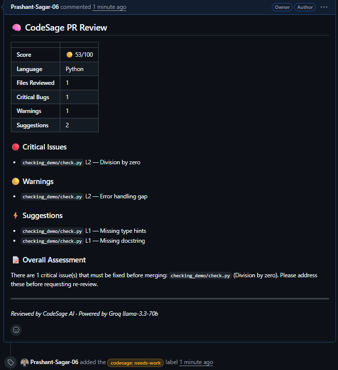
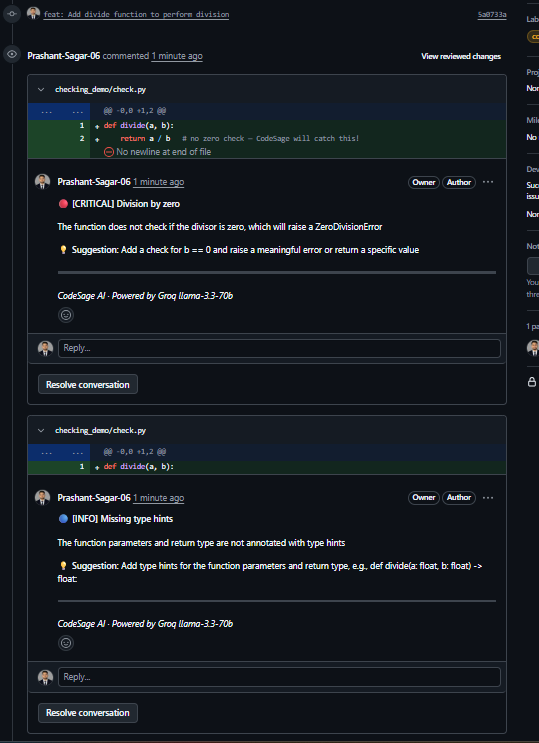

# 🧠 CodeSage PR Bot

> AI-powered GitHub Pull Request reviewer. When a developer opens or updates a PR, CodeSage fetches the diff, analyzes it with Groq LLM, and posts inline review comments + a scored summary — exactly like a senior engineer would.

---

## ✨ What It Does

- **Inline comments** on specific diff lines with severity, explanation, and a concrete fix
- **Scored summary** (0–100) with a breakdown of critical bugs, warnings, and suggestions  
- **Auto-labels** the PR: `codesage: looks-good`, `codesage: needs-work`, or `codesage: security-risk`
- **Async processing** — responds to GitHub in < 1 second, reviews in the background
- **Idempotent** — won't double-review if GitHub re-delivers a webhook

---

## 🏗️ Architecture

```
GitHub PR Event
      │
      ▼
FastAPI /webhook  ──► Verify HMAC-SHA256 signature
      │
      ▼ (background task)
github_client.py  ──► Fetch PR files + diffs
      │
      ▼
analyzer.py       ──► Orchestrate per-file reviews (async, max 3 concurrent)
      │
      ├── prompt_builder.py  ──► Build structured LLM prompt
      ├── llm_engine.py      ──► Groq API (3 retries, exponential backoff)
      └── parser.py          ──► Parse JSON → ReviewComment objects
      │
      ▼
github_client.py  ──► Post inline comments + summary + label
```

---

## 🚀 Quick Start

### 1. Clone and set up

```bash
git clone https://github.com/yourname/codesage-pr-bot
cd codesage-pr-bot
python -m venv .venv

# Windows
.venv\Scripts\activate
# macOS/Linux
source .venv/bin/activate

pip install -r requirements.txt
```

### 2. Configure environment

```bash
cp .env.example .env
```

Edit `.env` and fill in:

| Variable | Where to get it |
|---|---|
| `GROQ_API_KEY` | [console.groq.com](https://console.groq.com) — free tier |
| `GITHUB_TOKEN` | [GitHub Settings → Tokens](https://github.com/settings/tokens) — needs `repo` scope |
| `WEBHOOK_SECRET` | Any random string — `python -c "import secrets; print(secrets.token_hex(32))"` |

### 3. Start the server

```bash
uvicorn main:app --reload --port 8000
```

### 4. Expose to GitHub (dev only)

```bash
ngrok http 8000
```

Copy the `https://xxxx.ngrok.io` URL.

### 5. Register the webhook

In your GitHub repo → **Settings → Webhooks → Add webhook**:

| Field | Value |
|---|---|
| Payload URL | `https://xxxx.ngrok.io/webhook` |
| Content type | `application/json` |
| Secret | Same value as `WEBHOOK_SECRET` in `.env` |
| Events | Select **Pull requests** only |

### 6. Open a PR and watch the magic 🎉

---

## 📋 Working Example

Here's CodeSage in action on a real PR:

### Summary Review


CodeSage analyzes the entire PR and generates a scored report:
- **Score:** 53/100
- **Language:** Python
- **Files Reviewed:** 1
- **Critical Bugs:** 1 (Division by zero)
- **Warnings:** 1 (Error handling gap)
- **Suggestions:** 2 (Missing type hints, Missing docstring)

### Inline Comments


CodeSage posts detailed comments directly on the code:

#### 🔴 Critical Issue: Division by zero
```python
def divide(a, b):
    return a / b   # no zero check
```
**Issue:** The function does not check if the divisor is zero, which will raise a `ZeroDivisionError`  
**Fix:** Add a check for `b == 0` and raise a meaningful error or return a specific value

#### 🟡 Warning: Error handling gap
Missing try/except blocks for edge cases

#### 💡 Suggestions
- Add type hints: `def divide(a: float, b: float) -> float:`
- Add docstring explaining parameters and return type

### Overall Assessment
> There is 1 critical issue(s) that must be fixed before merging: `Division by zero`. Please address these before requesting re-review.

**Reviewed by:** CodeSage AI · Powered by Groq llama-3-70b

---

## 📦 Deployment (Permanent URL)

### Railway

```bash
# Install Railway CLI
npm install -g @railway/cli
railway login
railway init
railway up
```

Set env vars in Railway dashboard. Your bot will have a permanent URL.

### Render

1. Push to GitHub
2. New Web Service → connect repo
3. Build command: `pip install -r requirements.txt`
4. Start command: `uvicorn main:app --host 0.0.0.0 --port $PORT`
5. Add env vars in dashboard

---

## 🧪 Running Tests

```bash
pytest tests/ -v
```

---

## 📋 Example Review Output

**Inline comment:**
```
🔴 [CRITICAL] Division by zero

Variable `b` can be 0 here, causing a ZeroDivisionError at runtime.

💡 Suggestion: Add a guard: `if b == 0: return None`
```

**Summary comment:**

| | |
|---|---|
| **Score** | 🟡 72/100 |
| **Language** | Python |
| **Files Reviewed** | 3 |
| **Critical Bugs** | 1 |
| **Warnings** | 2 |
| **Suggestions** | 4 |

### 🔴 Critical Issues
- `utils.py` L14 — Division by zero

### 🟡 Warnings
- `main.py` L3 — Unused import `os`
- `helpers.py` L27 — Mutable default argument

---

## 🔧 Tech Stack

| Layer | Technology |
|---|---|
| Language | Python 3.11+ |
| Web Framework | FastAPI |
| AI Model | Groq `llama-3.3-70b-versatile` |
| GitHub API | PyGithub |
| ASGI Server | Uvicorn |
| Dev Tunnel | ngrok |
| Deployment | Railway / Render |

---

## 🔑 Key Engineering Decisions

**Webhook signature verification** — Every request verified with HMAC-SHA256. Prevents spoofed GitHub events.

**Per-file analysis** — Files sent individually to the LLM. Keeps prompts focused; avoids context window limits.

**Exponential backoff** — 3 retries with 2s → 4s → 8s delays. Essential for Groq rate limit resilience.

**Async background processing** — Webhook returns 200 in < 1s. Heavy analysis runs in a background task. GitHub requires a response within 10 seconds.

**Idempotency** — Tracks reviewed commit SHAs in PR comments. Skips re-review if GitHub re-delivers a webhook.

---

*Powered by Groq llama-3.3-70b · Built with FastAPI*
